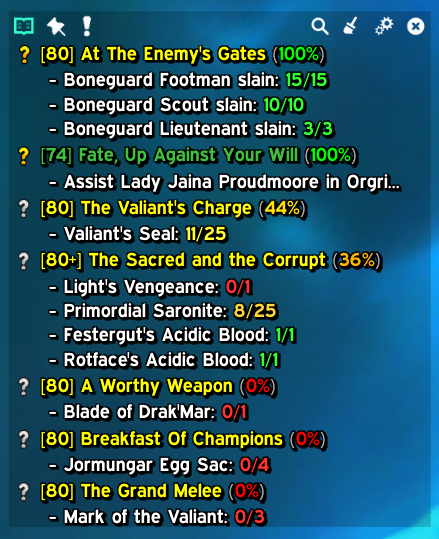
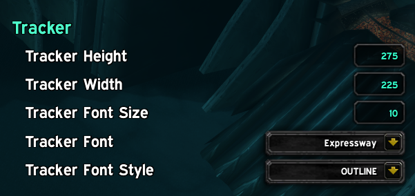

# pfQuest - ZeroMod

**ZeroMod for pfQuest** adds support for LibSharedMedia-3.0 fonts with customizable font sizes, outlines, and enhanced tracker configuration options.

## Screenshots

<table>
<tr>
<td></td>
<td></td>
</tr>
<tr>
<td align="center"><b>Enhanced Quest Tracker</b></td>
<td align="center"><b>Configuration Panel</b></td>
</tr>
</table>

---

## Features

### Enhanced Tracker Configuration

#### **Tracker Max Height**
- Sets the maximum height for the quest tracker frame
- When quest content exceeds this height, the tracker becomes **scrollable**
- Scroll using your **mousewheel** to view all tracked quests
- **No visible scrollbar** - just scroll naturally with your mouse
- The tracker dynamically shrinks when you have fewer quests

#### **Tracker Max Width**
- Sets the maximum width for the quest tracker frame
- Text that exceeds the width will be truncated
- *(Note: Text wrapping is being improved in future updates)*

#### **Font Selection (LibSharedMedia-3.0)**
- Choose from any font registered with LibSharedMedia-3.0
- Applies to all quest titles and objectives in the tracker
- Changes take effect immediately - no reload required
- Includes default WoW fonts plus any custom fonts you've installed

#### **Font Size**
- Customize the font size for all tracker text
- Adjustable to your preferred readability
- Changes apply instantly to all tracked quests

#### **Font Outline**
- Add text outlines for better readability
- Options: None, Outline, Thick Outline
- Helps text stand out against any background

---

## Installation

1. Download or clone this repository
2. Place the `pfQuest-Zero` folder in your `World of Warcraft/Interface/AddOns/` directory
3. Restart World of Warcraft or `/reload` if already running

---

## Requirements

- World of Warcraft 3.3.5 (WotLK)
- **LibSharedMedia-3.0** - Optional (defaults to Blizzard's built-in fonts if not installed; adds custom font support if installed)

---

## Synastria Server - Perk Support

If you are playing on the **Synastria** private server and want to see **Perks** displayed in the quest tracker, you must install the **SynastriaCoreLib** addon.

**Download:** [SynastriaCoreLib (Latest Release)](https://github.com/imevul/SynastriaCoreLib/releases/latest)

Without this library, perk information will not be available to pfQuest-Zero.

---

## Configuration

Open the pfQuest configuration panel:
- Type `/pfquest` or `/pq` in chat
- Navigate to the **Tracker** section
- Adjust the settings to your preference

All changes apply immediately!

---

## Known Incompatibilities

**WDM (World Drop Map) and similar subzone map addons** are not currently compatible with pfQuest-Zero. These addons modify the mapping system to display custom subzone maps, which causes pfQuest's database coordinates to be incorrect. The map IDs and X/Y coordinates returned by the game API no longer match the visual map being displayed, resulting in quest objectives and navigation arrows pointing to wrong locations.

---

## Credits

Based on [pfQuest](https://github.com/shagu/pfQuest) by Shagu

ZeroMod enhancements provided by Zero

---

⚠️ **WARNING**: For those out there that get angry about this sort of thing, please be aware AI was used in the development of this Mod of pfQuest. If this upsets you, please see yourself out. Thank you!
